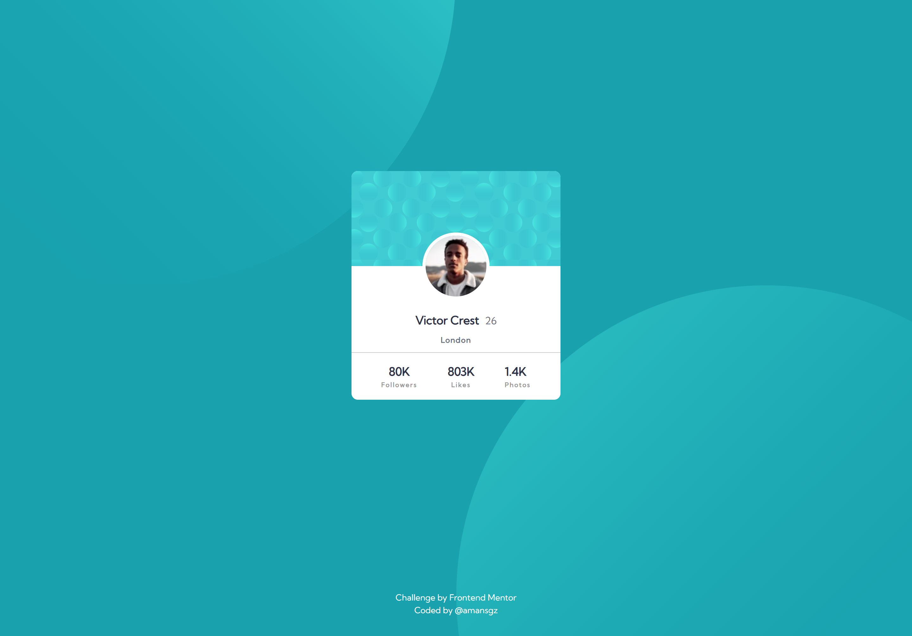

# 👩‍💻 Frontend Mentor - Profile card component

[Frontend Mentor challenges](https://www.frontendmentor.io/) help you improve your coding skills by building realistic projects.

This is a solution for [Profile Card Component challenge](https://www.frontendmentor.io/challenges/profile-card-component-cfArpWshJ)

## The challenge
The challenge is to build out this profile card component and get it looking as close to the design as possible.

## Built with

- Semantic HTML5 markup
- CSS custom properties
- Flexbox
- Mobile-first workflow

## Live site solution
[Live site](https://amansgz.github.io/css-profile-card-component/) deployed with GitHub Pages.

## Author

- Frontend Mentor - [@amansgz](https://www.frontendmentor.io/profile/amansgz)